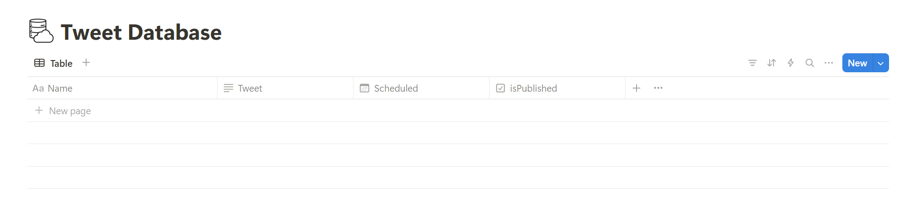
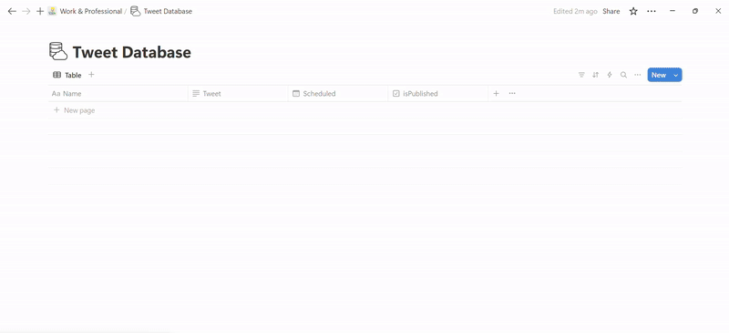
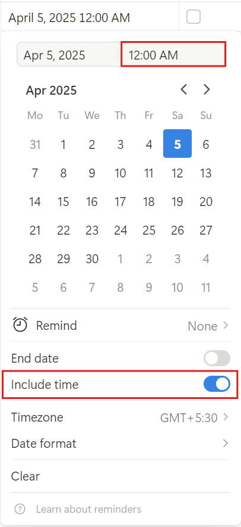

# notion-tweet-scheduler
 
## Tweet Scheduler with Notion + Twitter API

This is a tweet scheduler powered by Notion + X (Twitter) API. Schedule tweets in a Notion DB and this tool will auto-post them for you!

---

## 🚀 Features

- ✅ Schedule tweets in Notion using a Date + Time field
- ✅ Auto-post to Twitter using API
- ✅ Marks published tweets to avoid duplication
- ✅ Works as a background process or web service (Render)

---

## 📦 Setup Instructions

### 1. Clone the repo:
```bash
git clone https://github.com/theashutoshn/notion-tweet-scheduler.git
cd notion-tweet-scheduler
```

### 2. Install dependencies:
```bash
npm install
```

### 3. Copy .env.example to .env and fill in your secrets:
```bash
cp .env.example .env
```
In the .env file, paste the keys.

For Twitter, refer: https://docs.x.com/resources/fundamentals/authentication/oauth-1-0a/api-key-and-secret

For Notion keys, check below.
    
    
### 4. Run it:
```bash
node index.js
```


## Notion DB Setup
You must have notion account.

How to Create a database: https://www.youtube.com/watch?v=O8qdvSxDYNY

Your database should look like this:



For API keys, Visit https://www.notion.so/profile/integrations to create your API keys.

Once done, make sure to connect the database to your integration.




Property	|    Type	   |    Required
------------+--------------+------------
Tweet	    |   Rich text  |    Yes
Scheduled	|   Date	   |    Yes (with time)
isPublished	|   Checkbox   |    

Note: Every time you select date, make sure to use "Include Time" to set the time.



##  Deploy to Render
To Automate, use web services like Render, Railway, etc.